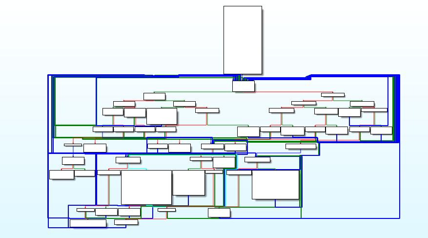
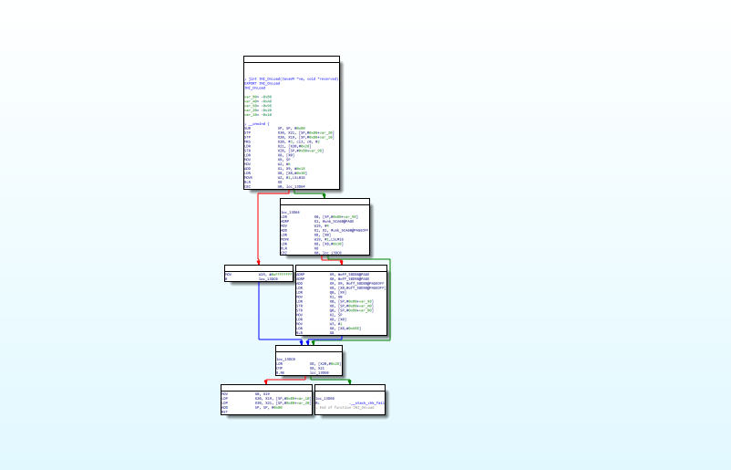
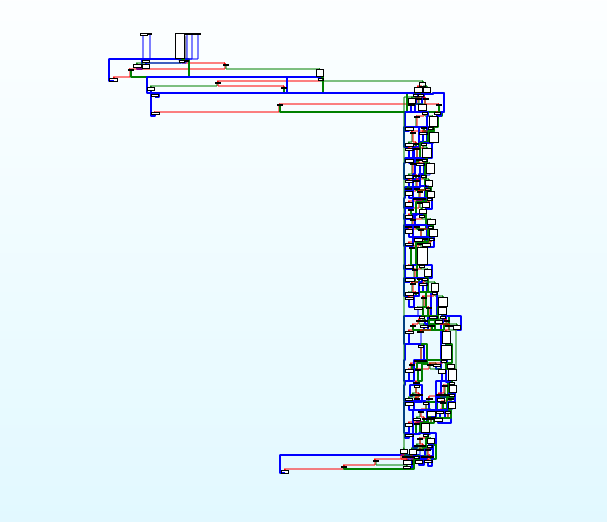
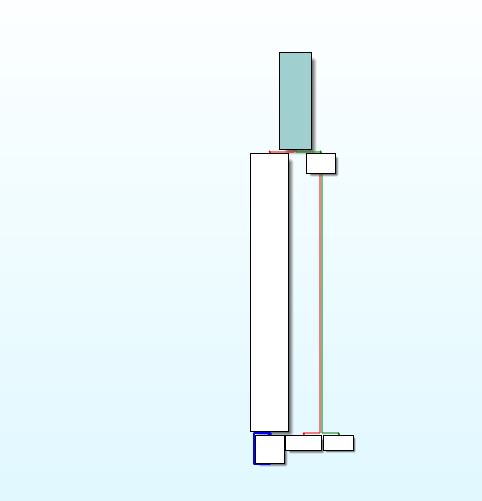
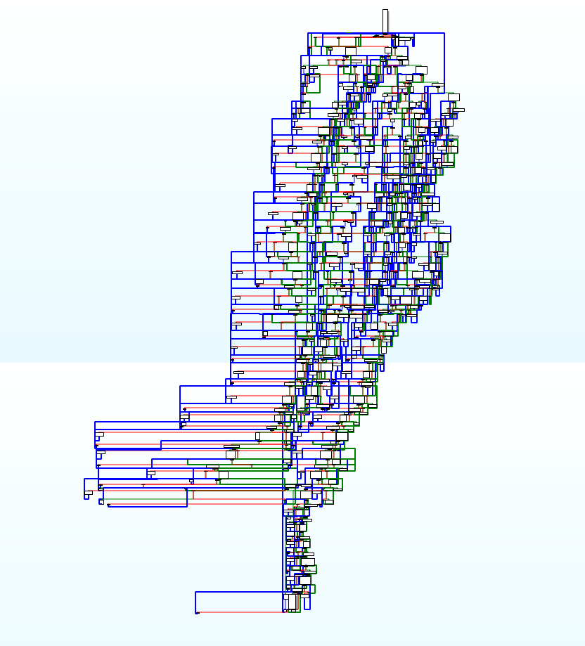
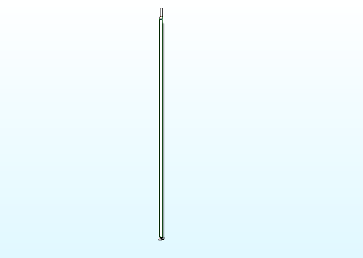
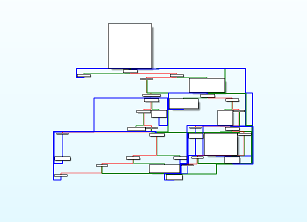
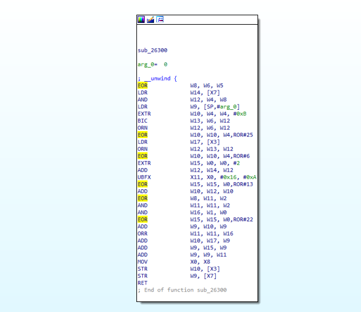
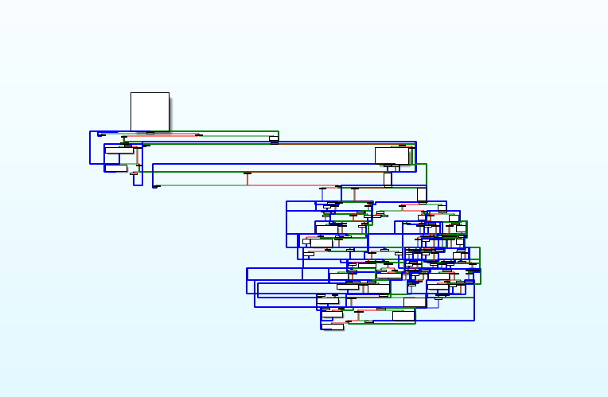
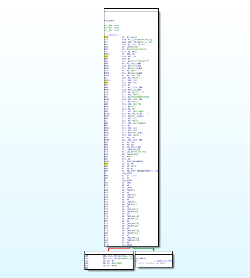

## 样本说明

来自看雪论坛[对ollvm的算法进行逆向分析和还原](https://bbs.pediy.com/thread-270529.htm)
- [libnative-lib.so](bin/libnative-lib.so) 原版混淆的二进制文件
- [libnative-lib-anti.so](bin/libnative-lib-anti.so) 去混淆后的二进制文件

### 去混淆函数
- JNI_ONLoad 正常混淆，导出函数可以使用 `--select-functions` 选项设置名称。该函数主要调用 `RegisterNatives` 注册C函数
- sub_12AE4 函数范围 0x12AE4-0x13AAC 存在很多小的混淆块，函数包含异常处理，还使用了向量指令，目前暂未添加该向量指令和异常处理，后续版本添加。
- sub_1D1E8 函数范围 0x1D1E8-0x26300 函数体较大，存在很多小混淆块
- sub_26300 函数范围 0x26300-0x26698 代码较少
- sub_1B89C 函数范围 0x1B89C-0x1C918 函数，代码量中等

### AntiOllvm 使用参数介绍
- `--select-functions` 设置去混淆的函数名称，该函数必须在符号表中
- `--select-ranges` 设置去混淆的地址范围，最好一个范围一个函数，避免生成其它不必要函数，当解码函数是 Thumb 函数时，需要起始地址 + 1用来标识这是 `Thumb` 方法
- `-l` 输出优化后的 LLVM 位码，这可以用来检查错误
- `--config` 设置配置文件路径，用来读取默认配置
- 其它用法这里暂不介绍，请查看后续帮助文档

### 去混淆过程
- 使用命令  
  ```shell
  antiollvm.exe --config D:\retdec\install\share\retdec\decompiler-config.json .\libnative-lib.so --select-ranges 0x26300-0x26698,0x1b89c-0x1c918 --select-functions JNI_OnLoad
  antiollvm.exe --config D:\retdec\install\share\retdec\decompiler-config.json .\libnative-lib.so --select-ranges 0x1d1e8-26300
  ```
  第一条命令3个函数体较小，可以一次性去混淆。sub_1D1E8 函数较大单独运行避免占用内存太多

- 生成文件
  - libnative-lib-anti.so 带有 `anti` 后缀是在原二进制文件的基础上替换掉混淆函数，多次运行不会覆盖它，只会在该文件基础上替换函数。
  - libnative-lib-compile.so 带有 `compile` 后缀是本次运行优化后的编译产物，该文件是可重定位文件，包含本次优化的所有相关变量和方法

### 去混淆效果对比
- JNI_ONLoad  

去混淆之前  
  

去混淆之后  


- sub_12AE4  

去混淆之前  
  

去混淆之后  


- sub_1D1E8  

去混淆之前  
  

去混淆之后  


- sub_26300  

去混淆之前  
  

去混淆之后  


- sub_1B89C  

去混淆之前  
  

去混淆之后  


### 演示视频
[视频地址](video/kanxueollvm2.mp4)
<video src="video/kanxueollvm2.mp4" controls="controls" width="100%" height="auto"/>