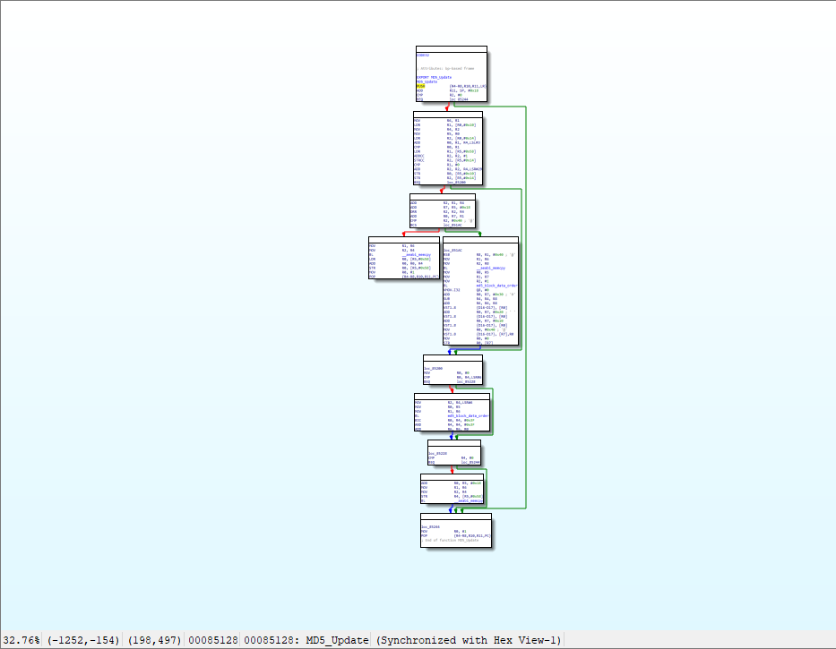
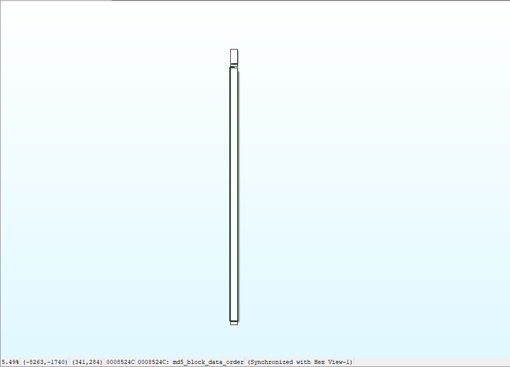
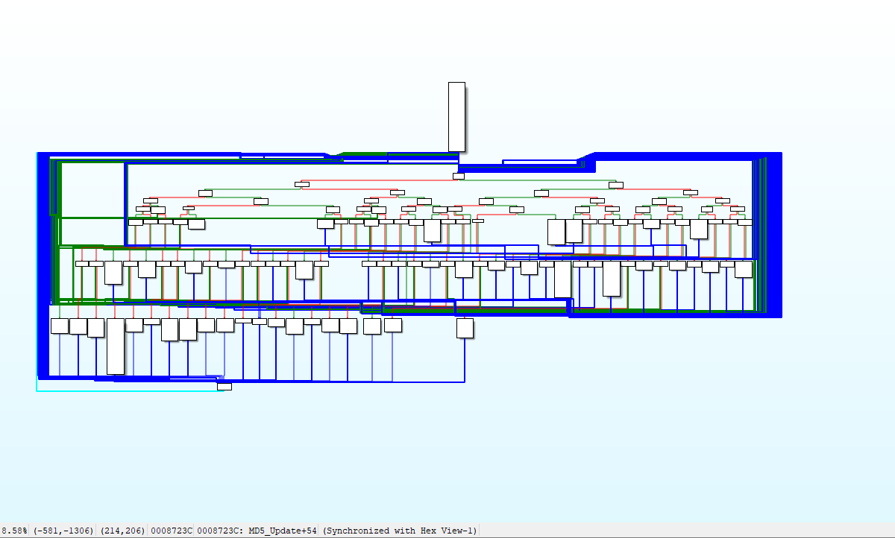
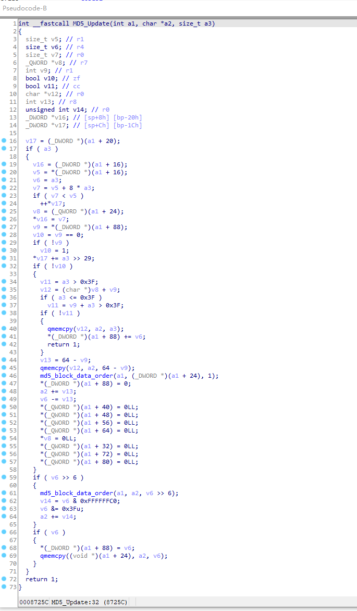
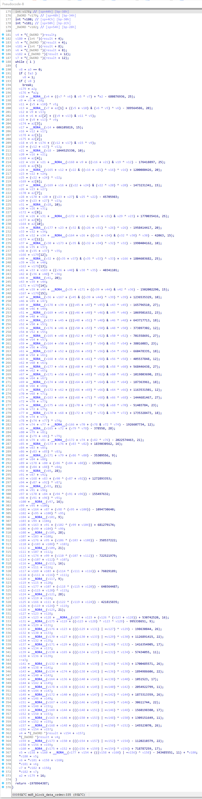
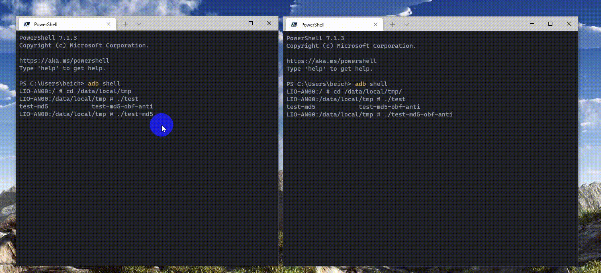

## 样本说明

- 测试库使用开源 [openssl-3.0.0-alpha15](https://github.com/openssl/openssl/releases/tag/openssl-3.0.0-alpha15)
- 编译采用 `Ollvm` 移植版 `Clang 11.0.5` 对应 `Android NDK android-ndk-r22b`，编译为 `Android` 可执行文件
- 编译混淆相关参数 `android-arm -D__ANDROID_API__=21 -mllvm -fla -mllvm -spli -mllvm -split_num=3 -mllvm -bcf -O3`
- 测试混淆函数与 MD5 算法有关的 `MD5_Update`，`md5_block_data_order`两个函数
- 未混淆二进制文件 [test-md5](../bin/binary-32-arm-android)
- 混淆后的二进制文件 [test-md5-obf](../bin/binary-32-arm-android)
- 去混淆后的二进制文件 [test-md5-obf-anti](../bin/binary-32-arm-android)

## 未添加混淆时

- `MD5_Update` 未混淆的 CFG 如下:
  
  它的 C 伪代码如下:
  

- `md5_block_data_order` 未混淆的 CFG
  
  C 伪代码:
  

## 添加混淆后

- `MD5_Update` 混淆的 CFG 如下:
  
  它的 C 伪代码如下:
  

- `md5_block_data_order` 混淆的 CFG
  
  C 伪代码:
  

## 去混淆后

- `MD5_Update` 去混淆后的 CFG
  
  它的 C 伪代码如下:
  

- `md5_block_data_order` 去混淆的 CFG
  
  C 伪代码:
  

## 代码运行演示

