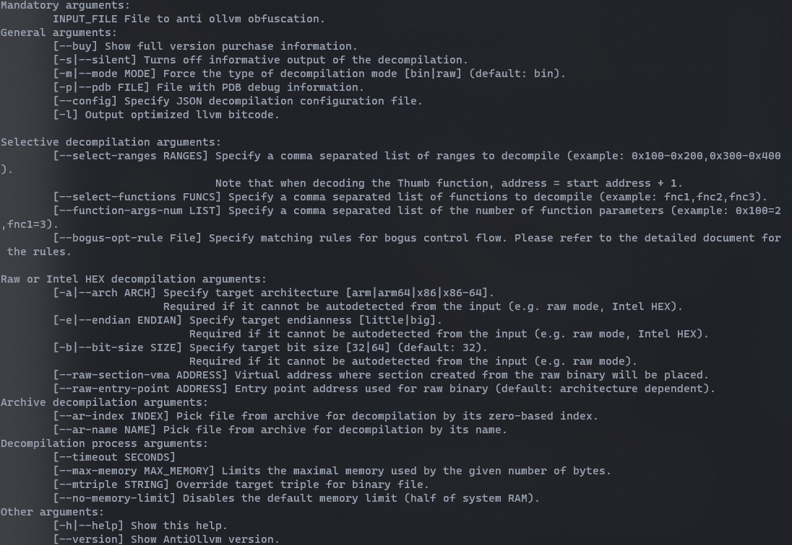

## 目录说明
保存 `AntiOllvm` 软件使用说明

## 软件帮助截图

## 参数介绍

- `-s` 关闭程序部分额外输出，目前无额外输出内容

- `-m|--mode` 设置输入文件的模式，`bin` 模式代表文件是正常可解析的二进制格式，没有加壳等，可以正常读取文件的架构、文件类型、起始函数、虚拟地址、符号表等等。`raw` 模式是资源模式，需要用户自己设置文件的解析方式才能读取，如设置 `-a` 文件目标指令集架构，`-e` 大小端等等。默认是 `bin` 模式

- `-p|--pdb` 输入文件的调试信息，便于更好的分析函数，没有则忽略。
- `--config` 设置软件配置文件，使用默认配置即可。
- `-l` 输出优化后的 `LLVM 位码`，可用来检查错误。

- `--select-ranges` 设置输入文件解码的范围，虚拟起始地址 - 虚拟结束地址，通常一个函数设置一个范围，避免解码不必要的指令。如果是 `bin` 模式则是正常读取到的函数地址，`raw` 模式是相对于 `--raw-section-vma` 的偏移，即起始地址 = 函数在文件位置 raw-section-vma。注意如果解码函数是Arm Thumb函数则需要 起始地址 + 1，用来标识该函数是Thumb模式，否者会被认为是Arm模式导致解码错误。

- `--select-functions` 设置解码函数名称，仅适用于 `bin` 模式，该函数必须在符号表中。

- `function-args-num` 修改函数的参数数量，如果解码的函数数量多于实际参数，则可以手动设置参数数量，生成更加优化的结果。格式为：函数起始地址=数量，方法名称=数量

- `-a|--arch` 设置输入文件的目标指令集架构，`raw` 模式必须设置
- `-e|--endian` 设置输入文件的大小端，`raw` 模式必须设置
- `-b|--bit-size` 设置了 `-a` 后会自动调整位大小，可以不用管
- `--raw-section-vma` `raw` 模式设置文件的起始虚拟地址
- `--raw-entry-point` `raw` 模式设置入口函数的虚拟地址，目前不解码入口函数
- `--ar-index`、`--ar-name` 选择解码归档文件中的索引或名字，例如静态库文件，实际混淆中基本不使用
- `--timeout` 设置软件运行超时时间（单位秒），默认不限制
- `--max-memory` 限制使用最大内存(单位Kb)，默认 实际内存/ 2
- `--no-memory-limit` 关闭内存使用限制
- `-h` 查看帮助信息
- `--version` 查看版本信息

## 使用注意
- 软件仅解码 `--select-functions`，`--select-ranges` 设置的函数，不支持全部

